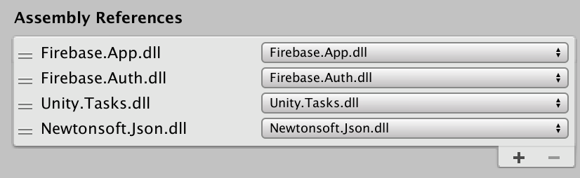

# Firestorm 


Makeshift Cloud Firestore C# API that works on Unity via pure REST API. Contains only basic functions.

## Why Cloud Firestore

- Cloud Firestore is described as better than Readtime Database in every way, except that it is in beta and no Unity SDK yet.
- Decision to use Realtime Database or Firestore is a big forked path, since it affects the way you would design as hierarchy with alternating collection-document (Firestore) or JSON tree design with lots of data duplications (RDB). There is probably 0% chance of easy migration. Unity devs will be faced with difficult decision of using RDB now and wait for SDK then having to overhaul design and migrate database, or just use Firestore with Firestorm while waiting for official SDK.
- The official C# Firestore API is available but Unity is not good with Nuget + it pulls in tons of dependencies that likely cause problem later. Firestorm puts all the work to `UnityWebRequest` to do REST call to ensure compatibility.

## Approach

- Use the currently available Unity Firebase SDK Auth to login before performing any Firestorm call.
- Firestorm will check on `FirebaseAuth.DefaultInstance.CurrentUser` and do `TokenAsync()`.
- The token will be an input to perform REST API call to Cloud Firestore.
- REST API performed by `UnityWebRequest`, which hopefully Unity will take care so it works with all platforms. (apparently Android could not do UWR PATCH header.. whoops)
- There is nothing related to service account. I don't want to add external dependency to the Firebase Admin package.
- The Firestorm API is designed to roughly resemble C# Firestore API so that the transition to the real thing is not painful when it arrives.

## Requires

- Unity 2019.1 (may work with 2018.3 but I have enough time to care about backward compatibility sorry..)
- C# 7.3
- Firebase Unity SDK : FirebaseAuth, FirebaseApp (it must cache the `FirebaseApp` instance to prevent GC hard crash described in the mid-January patch note)
- Unity.Tasks that comes with Firebase Unity SDK. The Auth wants it.
- Newtonsoft.Json

I put the requirement as an "assembly override" in the asmdef explicitly. It requires 4 `dll` total :



## Why not Unity's JsonUtility

It sucks! The JSON from Firestore has polymorphic union fields (see [example](https://firebase.google.com/docs/firestore/reference/rest/v1beta1/Value)) and it is impossible to work with without at least JSON to `Dictionary` support to put the field names as dict key then do reflections etc. I used Json.NET to iterate and peel out the JSON with `JObject` LINQ support and to tailor made a JSON that Firebase would accept.

## Limitations

I made this just enough to adopt Firestore as soon as possible. Features are at bare minimum. Code is a mess and also performance is really BAD. (Sent JSON are even indented just so that debugging would be easy..)

- Type excluded in a Document : Map (Map = dictionary of JSON not map as in world map), Geopoint (LatLng), bytes (use base-64 string instead).
- Any mentioned types that is in an array. Basically, recursive programming is hard and I don't want to mess with it + my game does not have nested map design. But hey! Array is implemented! A friend list per player for example can be strings in an array.
- On getting component you must provide a **type generic**. It **must** be a `class` (because it would be easy to do reflection to populate its value). If you would like to receive array, use `List<object>`. You take the risk of casting those objects if they are of different type! It will be reflected by field name of the document to match with what's in your type. The remaining fields are left at default. You cannot substitute any fields with `Dictionary<string, string>`.
- Transaction not supported. (You cannot do atomic operation that rolls back together when one thing fails)
- Manual rollback not supported. (There is a REST endpoint for this)
- Batched write not supported.
- Ordering not supported.
- Limiting not supported.
- Listening for realtime updates not supported.
- Query cursor/pagination not supported.
- Offline data not supported.
- Managing index not supported.
- Import/export data not supported.
- No admin API supported. (Use a work around by creating a "super user" with all allowed permission for the Firestore instead of a real service account)

Let's wait for the Unity SDK for those. (They are already all supported in regular C# Firestore SDK)

## How to use

Please look in the test assembly folder for a general idea, I don't have time to write a guide yet.. but it always begin with something like `Firestorm.Collection("c1").Document("d1").Collection("c1-1").Document("d2")._____`. (Use `FirebaseAuth.DefaultInstance` to sign in first! It works on the `CurrentUser`.)

When migrating to the real thing later, `Firestorm` would become `FirestoreDatabase` instance got from somewhere. Everything else should be roughly the same. (?)

## "Oh no REST sucks, why don't you use gRPC?"

In short I gave up, but it looks like a better than REST way if done right. It is just too messy with Unity. (In normal C# where NUGET is usable I would do RPC way.) Also the official C# API for Firestore uses the RPC + protobuf way, so no JSON mess like what I have here.

### What is it

It lets you do RPC with generated code, so it feels like you are calling regular function and it magically do remote calls. The code is generated from Protobuf file. The files in GRPC folder was grabbed from generated C# files from [Google API repo](https://github.com/googleapis/googleapis).

Therefore the code to talk with Firestore in Firestorm will feel just kinda like we already have Unity SDK, because the generated gRPC codes are in C# already. (Not by doing REST to a URL, etc.)

### What is the problem

Basically the "unloading assembly because it could cause crash in runtime" error message. I add and add all requirement by Nuget chain but finally arrives at the point where I don't know what is the cause of that anymore.

### Some pointers if you want to try doing it gRPC way

First install gRPC stuff, there is a beta `unitypackage` by Google too. See [here](https://packages.grpc.io/archive/2019/01/f7a4d1e0c74f3c76bd09d8f54ab1d2c357df2788-6affcdc9-9f89-475b-817b-14263e865b8e/index.xml) for example you can see **grpc_unity_package.1.19.0-dev.zip**. Then install gRPC csharp plugin from somewhere, Google it and you should found it. It allows `protoc` to generate client stub methods when it see `service` syntax in the `.proto` file.

(At the time when you are reading this things might changed already.) Use `artman` with things in the `googleapis` repo. Go to [here](https://googleapis-artman.readthedocs.io/en/latest/installing.html) and follow it. You will be installing `pipsi` and starting `docker` daemon before you can use `artman`, then you will have to download Docker image of Google's `artman` by following the terminal. Note that all the things surrounding gRPC and `googleapis` seems to be sparsely documented than usual.

Finally you will be running something like : 

```
~/.local/bin/artman --config google/firestore/artman_firestore.yaml generate csharp_gapic
```

The `yaml` file would be updated/changed in the future? I don't know..

You will now notice that the `artman` does not include the `Firestore.Admin` section, so you cannot do gRPC with admin API. Also it is missing some more references, you will have to install more Nuget package such as [CommonProtos](https://www.nuget.org/packages/Google.Api.CommonProtos/). And in an hours or two maybe you will arrive with the same "unloading assembly" error as me?

## How about Google.Cloud.Firestore

When I do 

```
nuget install google.cloud.firestore -Prerelease
```

I got tons of related Nuget which in turn resolves into gRPC again. I think it is scary and difficult to get it working (at runtime too) so I didn't continue this path either.